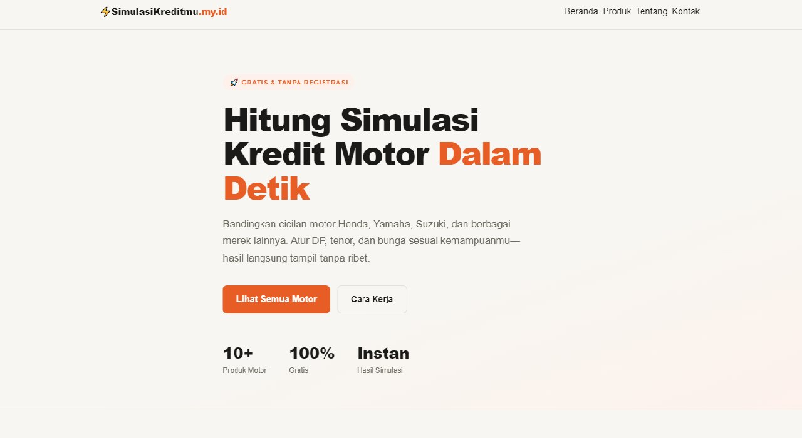
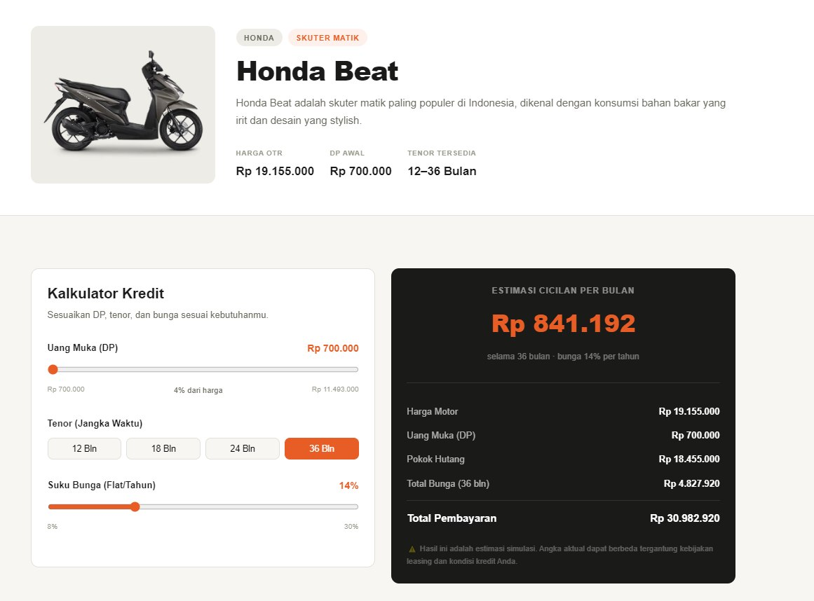
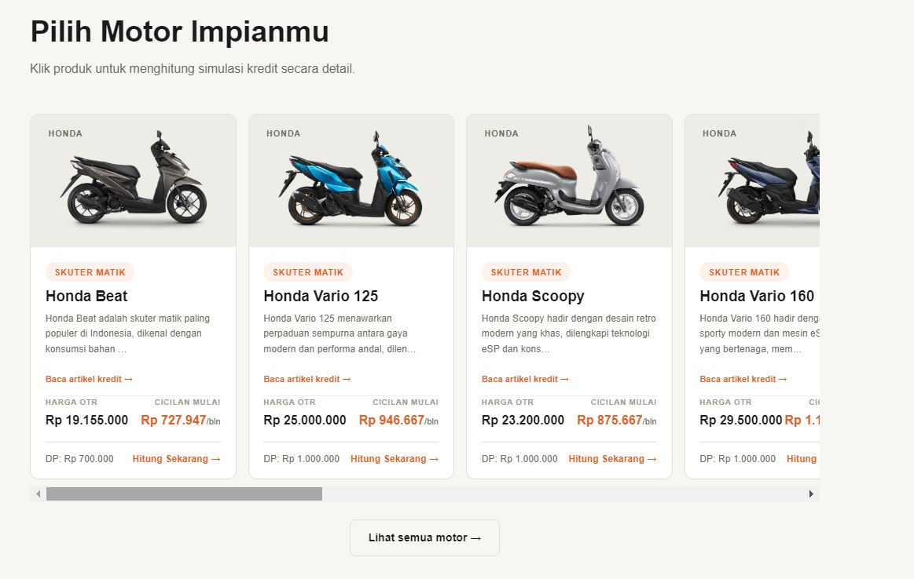

# 🚗 simulasikreditmu.my.id

> Website simulasi kredit motor yang SEO-friendly, responsive, dan siap dikembangkan menjadi platform informasi & kalkulator kredit kendaraan.

<p align="center">

<a href="https://simulasikreditmu.my.id">
  
</a>

</p>

---

## 📸 Preview

<p align="center">
  <a href="https://simulasikreditmu.my.id">
    
  </a>
</p>

<p align="center">
  <i>Click the preview to visit the live website.</i>
</p>

---

## ✨ Features

* 🧮 **Credit Calculator** — Simulasi cicilan berdasarkan harga, DP, dan tenor
* 🏍️ **Motor Catalog** — Daftar produk motor dengan estimasi cicilan
* 📄 **Dynamic Product Pages** — Halaman produk dibuat secara dinamis berdasarkan slug
* 📱 **Responsive Design** — Optimized for desktop, tablet, and mobile
* 🔍 **SEO Friendly** — Metadata, sitemap, robots.txt, and structured data
* 📊 **Product Information** — Spesifikasi dan informasi kendaraan
* 💰 **Monetization Ready** — Prepared for Google AdSense integration
* ⚡ **Fast & Lightweight** — Built with Next.js App Router
* 🗺️ **Automatic Sitemap** — Sitemap generated automatically from available products

---

## 🖥️ Screenshots

### 🏠 Homepage

<p align="center">
  <a href="https://simulasikreditmu.my.id">
    
  </a>
</p>

### 🧮 Credit Calculator

<p align="center">
  <a href="https://simulasikreditmu.my.id">
    
  </a>
</p>

### 🏍️ Product Page

<p align="center">
  <a href="https://simulasikreditmu.my.id">
    
  </a>
</p>

---

## 🌐 Live Demo

### 👉 [Visit simulasiKreditmu.my.id](https://simulasikreditmu.my.id)

The production website is deployed and accessible publicly.

---

## 🛠️ Tech Stack

| Technology             | Usage                                      |
| ---------------------- | ------------------------------------------ |
| **Next.js**            | React framework & application architecture |
| **TypeScript**         | Type-safe development                      |
| **Tailwind CSS**       | UI styling                                 |
| **Next.js App Router** | Routing & page rendering                   |
| **JSON-LD**            | Structured data for SEO                    |
| **Vercel**             | Deployment                                 |

---

## 📁 Project Structure

```text
simulasi_kredit/
├── app/
│   ├── layout.tsx
│   ├── page.tsx
│   ├── globals.css
│   ├── sitemap.ts
│   ├── robots.ts
│   │
│   ├── simulasi-kredit/
│   │   └── [slug]/
│   │       └── page.tsx
│   │
│   ├── tentang/
│   │   └── page.tsx
│   │
│   ├── kontak/
│   │   └── page.tsx
│   │
│   ├── privacy-policy/
│   │   └── page.tsx
│   │
│   └── disclaimer/
│       └── page.tsx
│
├── components/
│   ├── Navbar.tsx
│   ├── Footer.tsx
│   ├── LoanCalculator.tsx
│   └── Card.tsx
│
├── lib/
│   └── products.ts
│
├── screenshots/
│   ├── homepage.jpg
│   ├── calculator.jpg
│   └── product.jpg
│
└── README.md
```

---

## 🏍️ Adding a New Product

Open:

```text
lib/products.ts
```

Then add a new product to `productList`:

```typescript
{
  slug: "honda-vario-160",
  name: "Honda Vario 160",
  brand: "Honda",
  category: "Maxi Skuter",
  price: 35000000,
  dp: 7000000,
  tenor: [12, 18, 24, 36, 48],
  description: "Deskripsi singkat motor ini...",
  specs: {
    "Mesin": "160 cc, SOHC",
    "Transmisi": "Otomatis CVT",
  },
}
```

The product page will automatically become available at:

```text
/simulasi-kredit/honda-vario-160
```

---

## 🔍 SEO

The project includes several SEO-focused features:

* Unique metadata for product pages
* Dynamic `generateMetadata`
* JSON-LD structured data
* Automatic sitemap generation
* `robots.txt`
* SEO-friendly URL structure
* Dynamic product pages
* Responsive and mobile-friendly layout

Before production deployment, update the production domain inside:

```text
app/layout.tsx
app/sitemap.ts
```

For example:

```text
https://simulasikreditmu.my.id
```

---

## 💰 Monetization

The project is prepared for future monetization through platforms such as **Google AdSense**.

Example integration:

```tsx
<script
  async
  src="https://pagead2.googlesyndication.com/pagead/js/adsbygoogle.js?client=ca-pub-XXXXXXXXXX"
  crossOrigin="anonymous"
/>
```

An `AdBanner.tsx` component can then be added and placed on selected pages.

Potential monetization opportunities include:

* Google AdSense
* Affiliate links
* Dealer referrals
* Financing leads
* Sponsored listings
* Featured motorcycle products

---

## 🚀 Getting Started

### 1. Create the project

```bash
npx create-next-app@latest simulasi_kredit --typescript --tailwind --eslint --app
```

### 2. Enter the project

```bash
cd simulasi_kredit
```

### 3. Install dependencies

```bash
npm install
```

### 4. Run development server

```bash
npm run dev
```

Open:

```text
http://localhost:3000
```

---

## 📦 Production Build

Build the application:

```bash
npm run build
```

Start production server:

```bash
npm start
```

---

## ☁️ Deployment

The project can be deployed using **Vercel**:

```bash
npx vercel
```

Or connect the GitHub repository directly to Vercel for automatic deployments.

---

## 📌 Project Status

**Status:** 🚀 Active Development

The project is currently being developed with a focus on:

* Expanding motorcycle product data
* Improving credit calculation features
* SEO optimization
* Content expansion
* Monetization
* Performance improvements

---

## 📄 License

This project is for personal and educational purposes.

---

<p align="center">

Built with ❤️ using Next.js & TypeScript

<br>

<a href="https://simulasikreditmu.my.id">
  🌐 simulasiKreditmu.my.id
</a>

</p>
